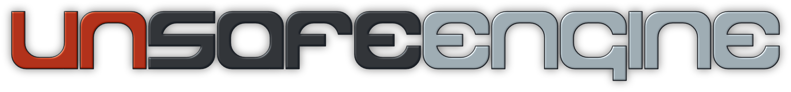

# The Unsafe Engine

Welcome to the official repository for the Unsafe Engine. Published under [Unsafe Games](https://unsafe.games), this engine is a cinematic, player-facing, single-roll, rules-lite, OSR-style, 3d6 roll-under tabletop RPG framework designed for high-stakes survival, granular resolution, with progression to 12th level. This system is designed for group play, coop play, and solo play, utilizing a built-in oracle-style, performance-based resolution system.

This repository serves as the central hub for developing the system reference documentation (SRD) and for tracking the core systems, hero options, and accessories. So, be aware, everything is subject to change.

More summarized information will be posted to this README as development progresses. Also, a changelog file is available.